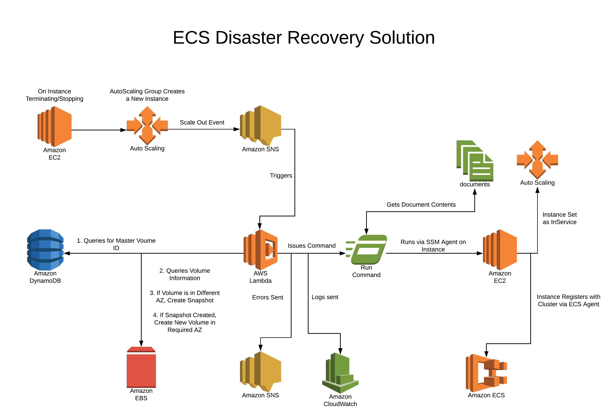

# ECS Disaster Recovery Solution

## Deployment

  1. Create the parameter files for your environment, (see `sandbox.json` and `sandbox-parameters.json` for the required parameters)
  1. Run:
    `./deploy.sh <environment name> <aws profile name>`
  1. Once that completes, run:
    `./create_codecommit_remote.sh <remote name> <aws profile name>`
  1. Set up your authentication against codecommit:
    ```bash
    git config --local credential.helper '!aws --profile <aws profile name> codecommit credential-helper $@'
    git config --local credential.UseHttpPath true
    ```
  1. Now you can `git push -u <remote name> master` which will trigger the pipeline to create the ECS Cluster
  1. For the volume you wish to recover you will now need to take the volume ID and most recent snapshot ID and add that to the created Dynamo Table:
      1. Open the AWS console
      1. Go to DynamoDB
      1. Open the table that's name begins with: `ecs-disaster-recovery-dev-MasterVolumeTable`
      1. Add an item that is of the form:

      | id | device | snapshotId | volumeId |
      | -- | ------ | ---------- | -------- |
      | 0 | /dev/xvdcy | snap-075c14ac3b4ff63e2 | vol-0da07f6a9e0a9f511 |

## How the Disaster Recovery Functions

In order to survive an Availability Zone (AZ) failure, when running a stateful container on ECS the volume needs to be recreated in the appropriate Availability Zone.

To achieve this, a Lambda function listens to the AutoScaling Group Scale Up event, which is triggered whenever a new instance is created. The function then makes a determination based on whether the new instance is in the same AZ as the volume and undertakes steps to attach the device and then mount it to the appropriate location.

## Architecture Diagram


